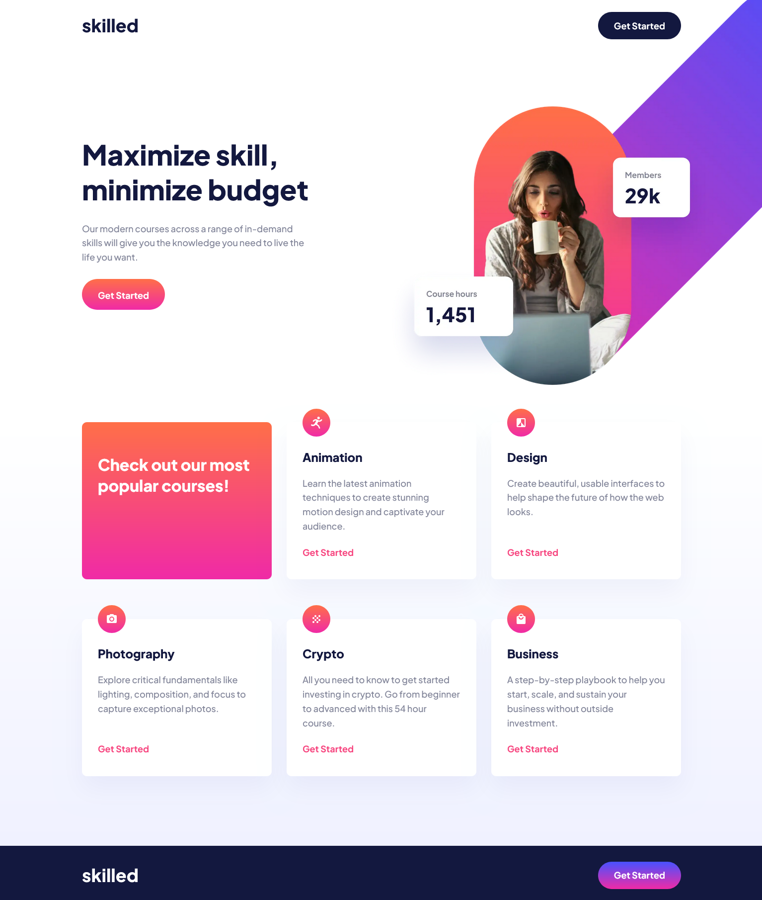

# Frontend Mentor - Skilled e-learning landing page solution

This is a solution to the [Skilled e-learning landing page challenge on Frontend Mentor](https://www.frontendmentor.io/challenges/skilled-elearning-landing-page-S1ObDrZ8q).

## Table of contents

- [Overview](#overview)
  - [The challenge](#the-challenge)
  - [Screenshot](#screenshot)
  - [Links](#links)
- [My process](#my-process)
  - [Built with](#built-with)
  - [What I learned](#what-i-learned)
  - [Continued development](#continued-development)
  - [Useful resources](#useful-resources)
- [Author](#author)
- [Acknowledgments](#acknowledgments)

## Overview

### The challenge

Users should be able to:

- View the optimal layout depending on their device's screen size
- See hover states for interactive elements

### Screenshot

### Links

- Solution URL: [Github](https://github.com/kaamiik/fm-Skilled-Elearning-Landing-Page)
- Live Site URL: [Vercel](https://fm-skilled-elearning-landing-page-azure.vercel.app/#)

## My process

### Built with

- Semantic HTML5 markup
- CSS custom properties
- Flexbox
- CSS Grid
- Mobile-first workflow
- Sass

### What I learned

- Using flex settings into a grid item
- Good challenges on Grid layout
- Absolute positioning challenge

## Author

- Frontend Mentor - [@kaamiik](https://www.frontendmentor.io/profile/kaamiik)
- Twitter - [@kiaakamran](https://www.twitter.com/kiaakamran)
